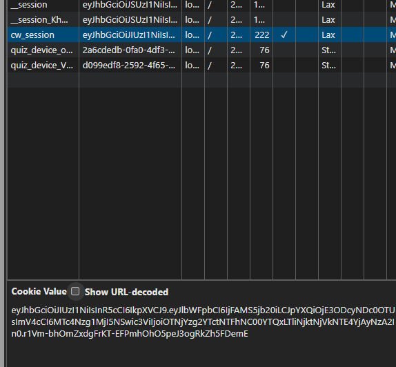
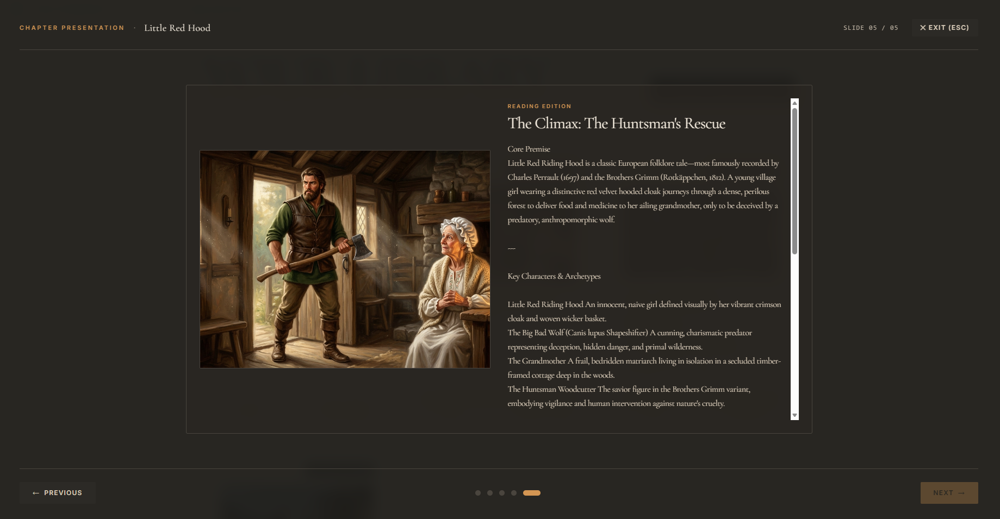

# Testing Strategy

Vitest on both sides, one runner, one command: **`npm test`** from the repo root. Server tests
drive real HTTP through supertest; client tests render components in jsdom with Testing Library.

## What I test, and why

The graded risks in this project are **state correctness under concurrency** and **not losing
work**. That is where the tests go. I am not chasing a coverage number.

### Backend

| Area                                | AI Covered | Human check                                                                                                                                              | The failure it's there to catch                                                                                                              |
| ----------------------------------- | ---------- | -------------------------------------------------------------------------------------------------------------------------------------------------------- | -------------------------------------------------------------------------------------------------------------------------------------------- |
| Identity: sign-up                   | ✅         | ✅ Sign in with a brand-new email → a new entry appears in `data/users.json`                                                                             | First sign-in creates the user and returns a token                                                                                           |
| Identity: sign-in                   | ✅         | ✅ Sign in again with the same email in different casing → same `id` back, still one entry                                                               | A known email returns the _same_ user id — matched case- and whitespace-insensitively — instead of creating a duplicate                      |
| Identity: races                     | ✅         | ✅ Double-click the sign-in button → exactly one user created                                                                                            | Concurrent sign-ins don't drop users; the same new email arriving 5× still yields one id                                                     |
| Identity: validation                | ✅         | ✅ Submit `not-an-email`, then a blank name → 400 both times, nothing written                                                                            | Malformed email or blank name → 400                                                                                                          |
| Session: cookie flags               | ✅         | ✅ Devtools → Application → Cookies: `cw_session` shows **HttpOnly ✓**, SameSite `Lax`. Then run `document.cookie` in the console → it is **not** listed | A session cookie missing `HttpOnly` is readable by any XSS payload; a wrong `Max-Age` logs the user out early or leaves a dead cookie behind |
| Session: cookie is the only carrier | ✅         | ✅ `curl -H "Authorization: Bearer <any>" localhost:4000/api/auth/me` → 401                                                                              | A bearer fallback hands an XSS payload a way to present a stolen token                                                                       |
| Session restore                     | ✅         | ✅ Refresh the browser → still signed in                                                                                                                 | `GET /api/auth/me` rehydrates the session after a refresh; missing, tampered, and wrongly-signed cookies → 401                               |
| Logout                              | ✅         | ✅ Sign out → the cookie is gone from devtools and protected routes 401 again                                                                            | With `httpOnly` the client cannot clear its own session, so a broken logout endpoint leaves the user signed in                               |
| Step 00: Anchor Chaining            | ✅         | ✅Creating project sets `interactions.ingestionId`; later steps never retransmit raw text                                                                | Book text is ingested once and referenced by ID across later steps                                                                           |
| Step 01: Art Style Derivation       | ✅         | ✅ Run Step 1 with no selection → derives visual tone with twist, stores `project.style` and covers selection cards                                      | Manuscript tone and genre are analyzed to establish unified visual style prompt                                                              |
| Step 02: Characters Extraction      | ✅         | ✅ Run Step 2 → returns at most 2 adult characters with visual prompt and description                                                                    | Server strictly caps to max 2 adults (no children) to bound token usage and costs                                                            |
| Step 03: Character Portraits        | ✅         | ✅ Run Step 3 → renders PNG portrait plates for each character, saved to disk and streamed to UI                                                         | Generates character portrait binaries matching the Step 1 style for later multi-image conditioning                                           |
| Step 04: Chapter Scene Formulation  | ✅         | ✅ Run Step 4 → formulates single chapter scene prompt referencing character portraits                                                                   | Server strictly caps to 1 chapter scene and formulates composition prompt for Step 5                                                         |
| Step 05: Master Composition Plate   | ✅         | ✅ Run Step 5 → renders master composition illustration plate and unlocks First Edition Result View                                                      | Synthesizes final chapter artwork referencing previous character portrait outputs                                                            |
| Duplicate-run guard                 | ✅         | ✅ Run step simultaneously in second tab → returns 409 Conflict, single Gemini call dispatched                                                           | Server prevents duplicate executions on running projects across tabs                                                                         |
| Retry after a failed step           | ✅         | ✅                                                                                                                                                       | A Gemini failure is recorded on the project and that step alone reruns to success; earlier steps and the interaction chain survive           |
| Structured-output failure           | ✅         | ✅                                                                                                                                                       | A model answering with prose where JSON was required fails the step instead of being papered over with a regex                               |
| Ownership isolation                 | ✅         | ✅                                                                                                                                                       | Another user's project id returns 404 rather than 403, so project existence is not leaked                                                    |
| Websocket efficiency                | ✅         | ✅                                                                                                                                                       |                                                                                                                                              |
| Adding new attempt history          | ✅         | ✅                                                                                                                                                       |                                                                                                                                              |
| Presentation for each chapter       | ✅         | ✅                                                                                                                                                       |                                                                                                                                              |

✅ automated and passing

```
$ npm test

> chapter-whisper@1.0.0 test
> npm run test --workspace=server && npm run test --workspace=client


> chapter-whisper-server@1.0.0 test
> vitest run


 RUN  v3.2.7 D:/CODE/SideRepos/ChapterWhisper/server

 ✓ tests/json-file.test.ts (5 tests) 87ms
 ✓ tests/health.test.ts (1 test) 22ms
 ✓ tests/websocket.test.ts (3 tests) 112ms
 ✓ tests/projects.test.ts (6 tests) 243ms
 ✓ tests/auth.test.ts (12 tests) 274ms
 ✓ tests/pipeline.test.ts (12 tests) 641ms

 Test Files  6 passed (6)
      Tests  39 passed (39)

> chapter-whisper-client@1.0.0 test
> vitest run


 RUN  v3.2.7 D:/CODE/SideRepos/ChapterWhisper/client

 ✓ src/test/health.test.ts (2 tests) 5ms
 ✓ src/test/usePipeline.test.ts (7 tests) 111ms
 ✓ src/test/LibraryView.test.tsx (3 tests) 424ms
 ✓ src/test/ResultView.test.tsx (3 tests) 436ms
 ✓ src/test/App.test.tsx (3 tests) 402ms

 Test Files  9 passed (9)
      Tests  34 passed (34)
```

**Human check** is the manual pass a reviewer runs to confirm the behavior end to end. The
automated test proves the unit; the human check proves the product. The rows that matter most
here — refresh, second tab, server restart — are only fully convincing when a person does them.

The lost-update test was verified to fail before it was trusted: with `withFileLock` removed
from `updateJson`, `serializes overlapping read-modify-writes` fails and the other four still
pass. A concurrency test that cannot fail is decoration.

### Frontend

| Area                                           | AI Covered | Human check                                                                                                   | Notes                                                                                                  |
| ---------------------------------------------- | ---------- | ------------------------------------------------------------------------------------------------------------- | ------------------------------------------------------------------------------------------------------ |
| App renders and reports backend status         | ✅         | ✅ Open `http://localhost:3000` → header and backend status render, no console errors                         | Smoke test in jsdom (`App.test.tsx`, `health.test.ts`)                                                 |
| Login form: loading / error / empty            | ✅         | ✅ Submit empty; submit a bad email; stop the server and submit → three distinct states, no dead button       | Passwordless auth & input validation (`LoginScreen.test.tsx`, `useAuth.test.ts`)                       |
| Project list: empty state & cards              | ✅         | ✅ Sign in as a fresh user → a real empty state; create projects → live progress bar and stages               | Visual library archive with 5-stage progress indicator (`LibraryView.test.tsx`, `useProjects.test.ts`) |
| Manuscript ingestion & new project wizard      | ✅         | ✅ Submit empty title/text; upload `.txt` file; observe single ingestion indicator                            | Text validation and upload workflow (`NewProjectView.test.tsx`)                                        |
| Step runner: in-progress and error affordances | ✅         | ✅ Run a step → the UI names _which_ step is running. Network failure → error banner plus isolated step retry | `usePipeline` hook with failure boundary and step retry state machine (`usePipeline.test.ts`)          |
| First Edition Result View                      | ✅         | ✅ Complete all 5 steps → master composition plate renders with featuring cast and scene prompt               | Master plate, portraits, and scene dossier (`ResultView.test.tsx`)                                     |
| Websocket efficiency<br>                       | ✅         | ✅                                                                                                            |                                                                                                        |
| Adding new attempt history<br>                 | ✅         | ✅                                                                                                            |                                                                                                        |
| Presentation for each chapter                  | ✅         | ✅                                                                                                            |                                                                                                        |

## Deliberately not tested

- Live Gemini API Integration (Real Network Calls): Due to excessive quota limitation
- Didnt test user A can view user B assets or not? Did have jwt applied but didnt apply widely cross functions in middleware.
- File Upload Format Restrictions (NewProjectView.tsx): Didnt test non-text formats (.pdg, .docx)

## Test run

Two real runs, pasted as emitted. The only modification is that terminal colour escape
codes were stripped (`sed 's/ \[[0-9;]*m//g'`) so the text is readable in markdown —
no lines added, removed, reordered, or reworded.

Per-test detail, from `npx vitest run --reporter=verbose` inside `server/`:

```
 ✓ tests/json-file.test.ts > json-file store > returns the fallback for a file that does not exist yet 2ms
 ✓ tests/json-file.test.ts > json-file store > creates missing parent directories on write 5ms
 ✓ tests/json-file.test.ts > json-file store > leaves no temp files behind 3ms
 ✓ tests/json-file.test.ts > json-file store > serializes overlapping read-modify-writes instead of losing them 50ms
 ✓ tests/json-file.test.ts > json-file store > keeps the queue moving after a failed update 7ms
 ✓ tests/health.test.ts > GET /api/health > returns status ok and server confirmation message 41ms
 ✓ tests/projects.test.ts > Projects & Pipeline API > rejects unauthenticated requests 63ms
 ✓ tests/projects.test.ts > Projects & Pipeline API > creates a new project with step 00 anchor id & sliced statuses 27ms
 ✓ tests/pipeline.test.ts > Step 01 - art style > stores a user-supplied style and registers it with the model 84ms
 ✓ tests/auth.test.ts > POST /api/auth/login > creates a user on first sign-in and returns the user 61ms
 ✓ tests/auth.test.ts > POST /api/auth/login > never puts the token in the response body 14ms
 ✓ tests/auth.test.ts > POST /api/auth/login > sets an httpOnly, sameSite session cookie 10ms
 ✓ tests/auth.test.ts > POST /api/auth/login > returns the same user for a known email instead of creating a second one 28ms
 ✓ tests/projects.test.ts > Projects & Pipeline API > prevents running locked steps 35ms
 ✓ tests/projects.test.ts > Projects & Pipeline API > refuses to re-run a completed step 49ms
 ✓ tests/auth.test.ts > POST /api/auth/login > rejects a malformed email or a blank name 16ms
 ✓ tests/pipeline.test.ts > Step 01 - art style > derives a style from the book when none is supplied 45ms
 ✓ tests/pipeline.test.ts > Step 02 - characters > chains off the style interaction 49ms
 ✓ tests/projects.test.ts > Projects & Pipeline API > executes Step 1 (Style), Step 2 (Characters), Step 3 (Portraits), and Step 4 (Chapters) sequentially 96ms
 ✓ tests/auth.test.ts > POST /api/auth/login > does not lose users when sign-ins arrive concurrently 98ms
 ✓ tests/auth.test.ts > POST /api/auth/login > creates exactly one user when the same new email races itself 46ms
 ✓ tests/auth.test.ts > GET /api/auth/me > restores the session from the cookie, as a refresh would 25ms
 ✓ tests/auth.test.ts > GET /api/auth/me > rejects a missing, tampered, or wrongly-signed cookie 16ms
 ✓ tests/auth.test.ts > GET /api/auth/me > ignores a bearer header — the cookie is the only accepted carrier 9ms
 ✓ tests/pipeline.test.ts > Step 02 - characters > fails the step when the model answers with prose instead of JSON 58ms
 ✓ tests/pipeline.test.ts > Step 03 - portraits > writes one PNG per character and serves it back through the API 89ms
 ✓ tests/auth.test.ts > POST /api/auth/logout > clears the session so protected routes reject again 32ms
 ✓ tests/auth.test.ts > POST /api/auth/logout > is safe to call when not signed in 6ms
 ✓ tests/pipeline.test.ts > Step 04 - chapter scene > stores exactly one scene and unlocks step 05 93ms
 ✓ tests/pipeline.test.ts > Step 04 - chapter scene > truncates an array answer to one chapter, so the cap holds either way 59ms
 ✓ tests/pipeline.test.ts > Step 05 - illustration > renders the final plate and serves it 61ms
 ✓ tests/pipeline.test.ts > Pipeline guarantees > sends the book text exactly once, at ingestion 66ms
 ✓ tests/pipeline.test.ts > Pipeline guarantees > leaves a failed step retryable, with nothing else lost 30ms
 ✓ tests/pipeline.test.ts > Pipeline guarantees > answers 409 to a second run while the step is still running 46ms
 ✓ tests/pipeline.test.ts > Pipeline guarantees > hides another users project behind a 404 33ms

 Test Files  5 passed (5)
      Tests  35 passed (35)
   Start at  02:51:31
   Duration  1.61s (transform 290ms, setup 0ms, collect 1.95s, tests 1.48s, environment 1ms, prepare 917ms)
```

And inside `client/`:

```
 ✓ src/test/health.test.ts > Client environment & HTTP configuration > instantiates ApiError with status and message 2ms
 ✓ src/test/health.test.ts > Client environment & HTTP configuration > runs within a jsdom DOM environment with localStorage available 0ms
 ✓ src/test/usePipeline.test.ts > usePipeline — step 0 wiring > posts the chosen style and applies the returned project 25ms
 ✓ src/test/usePipeline.test.ts > usePipeline — step 0 wiring > omits the style so the model derives one from the book 7ms
 ✓ src/test/usePipeline.test.ts > usePipeline — step 0 wiring > treats HTTP 200 with a failed status as a failure, not a success 6ms
 ✓ src/test/usePipeline.test.ts > usePipeline — step 0 wiring > surfaces the 409 duplicate-run guard and resyncs from the server 20ms
 ✓ src/test/usePipeline.test.ts > usePipeline — step 0 wiring > refuses to re-run a completed step without calling the server 2ms
 ✓ src/test/usePipeline.test.ts > usePipeline — step 0 wiring > refuses to run a locked step without calling the server 2ms
 ✓ src/test/usePipeline.test.ts > usePipeline — step 0 wiring > wires and executes Step 1 (Characters), Step 2 (Portraits), and Step 3 (Chapters) through usePipeline 7ms
 ✓ src/test/useProjects.test.ts > useProjects hook > fetches and populates project list when user is present 89ms
 ✓ src/test/useAuth.test.ts > useAuth hook > restores user from /api/auth/me on mount when session cookie exists 97ms
 ✓ src/test/ResultView.test.tsx > ResultView Component > renders title, final plate, character cast, and scene dossier 62ms
 ✓ src/test/ResultView.test.tsx > ResultView Component > triggers navigation actions when back and library buttons are clicked 170ms
 ✓ src/test/useProjects.test.ts > useProjects hook > clears project shelf when user is null / signs out 79ms
 ✓ src/test/LoginScreen.test.tsx > LoginScreen Component > renders branding and input fields 215ms
 ✓ src/test/LoginScreen.test.tsx > LoginScreen Component > triggers onNameChange and onEmailChange callbacks when typing 15ms
 ✓ src/test/LoginScreen.test.tsx > LoginScreen Component > calls onSubmit on form submission 34ms
 ✓ src/test/useAuth.test.ts > useAuth hook > falls back to null user when 401 response is returned 73ms
 ✓ src/test/LibraryView.test.tsx > LibraryView Component > renders user archive header and button to begin a new chapter 208ms
 ✓ src/test/LibraryView.test.tsx > LibraryView Component > renders project list with step badges, word count and opens project on click 66ms
 ✓ src/test/useProjects.test.ts > useProjects hook > creates project, applies it to the list, and sets it active 79ms
 ✓ src/test/useProjects.test.ts > useProjects hook > validates blank title and manuscript text before posting 8ms
 ✓ src/test/useProjects.test.ts > useProjects hook > opens project by id and syncs fresh data from server 81ms
 ✓ src/test/NewProjectView.test.tsx > NewProjectView Component > renders inputs, upload area, and guidance sidebar 232ms
 ✓ src/test/NewProjectView.test.tsx > NewProjectView Component > updates title and manuscript text and enables submit button 94ms
 ✓ src/test/NewProjectView.test.tsx > NewProjectView Component > displays ingesting state when creating is true 44ms
 ✓ src/test/useAuth.test.ts > useAuth hook > logs in successfully and caches user to localStorage 90ms
 ✓ src/test/useAuth.test.ts > useAuth hook > handles login failure cleanly and notifies via toast 83ms
 ✓ src/test/App.test.tsx > App component > renders login screen by default 271ms
 ✓ src/test/useAuth.test.ts > useAuth hook > logs out and clears session state & localStorage 75ms
 ✓ src/test/App.test.tsx > App component > allows logging in and viewing the library 104ms
 ✓ src/test/App.test.tsx > App component > lists the projects the server returns 77ms

 Test Files  9 passed (9)
      Tests  32 passed (32)
   Start at  02:51:25
   Duration  3.20s (transform 630ms, setup 1.38s, collect 2.48s, tests 2.44s, environment 13.58s, prepare 1.49s)
```

Reproduce it yourself with `npm test` — the suite needs no `.env` and no network.

## Running them

```bash
npm test                                              # both workspaces
npm run test:server                                   # server only
npm run test:client                                   # client only
npm test --workspace=server -- tests/auth.test.ts     # one file
npm test --workspace=server -- -t "races itself"      # one test by name
npx vitest                                            # watch mode, inside server/ or client/
```

## Some integration test images on UI





